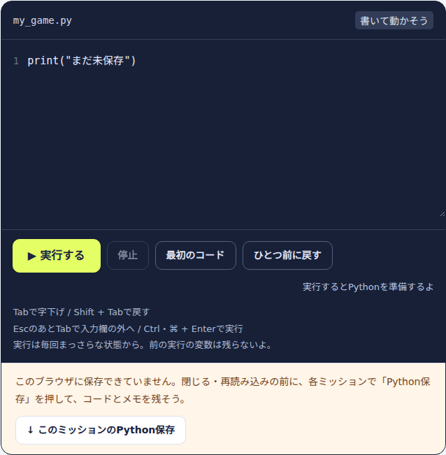
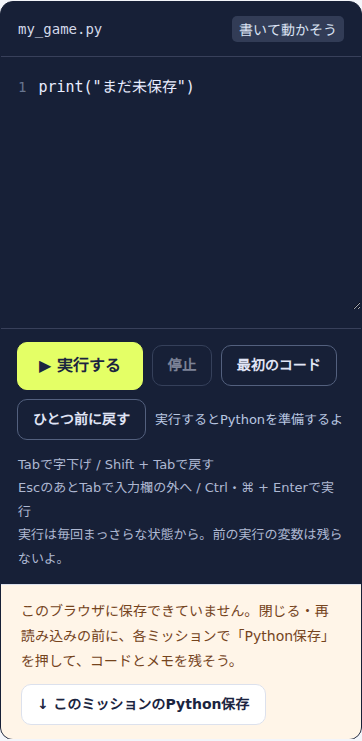

# 第1回の修正：説明と操作の信頼性

2026年9月26日。全体点検の実施順1にある **A01・A28・A31・A32の4件**を修正しました。この記録は初回の修正・検証内容です。その後、利用者の継続的な公開指示により、[PR #4](https://github.com/hirasunaryou/for_KT_family/pull/4)で2026-09-26に公開しました。公開後の主要22ファイルの照合・操作確認も完了しています。

## 何が変わるか

| 課題 | 修正後の動き・説明 | 確認したこと |
| --- | --- | --- |
| A01 平方根の説明 | 「36の平方根は6」を「√36 = 6」に変更。平方根が±6であることと、√36が正の方を表すことを混同させない | 計算式と前の「平方根の意味」の説明との整合性を確認 |
| A28 本文へスキップ | 金庫・迷路・ドット絵で、今の章を保ったまま本文へ移る | 3教材×8画面でTab→Enter、本文へのフォーカス、スクロール、URL・開いた説明の維持、その後のTabと通常の章移動 |
| A31 コード欄のキーボード操作 | Tabで4文字分の字下げ、Shift+Tabで戻す。選択時は行単位で処理。EscのあとTabで外へ、EscのあとShift+Tabで前へ移る | 文字が消えないこと、先頭空行・複数行・空白途中の選択終点・逆方向の選択、欄への戻り、Ctrl+Enter実行 |
| A32 保存できないときの表示 | 保存不可の案内をコード欄のそばに残す。その場から現在のミッションのコードとメモをPythonファイルに保存できる | 初回からの保存拒否、途中の容量超過、5秒を過ぎても案内が残ること、ダウンロード内容、章移動、保存復旧と再読み込み |

保存できる場合は、実際の書き込みに成功してから「保存しました」と表示します。失敗中はサイドバーとメモ欄の説明も切り替わります。手動のPython保存は**現在のミッションのコードとメモ**が対象で、全ミッションの一括バックアップや進捗の保存ではありません。そのため、ページを閉じる前に各ミッションで保存する案内にしています。

ダウンロード用の `dice-lab.html` は共通のJavaScript/CSSから再生成しました。Web版だけでなく、保存したHTMLをローカルファイルとして開いた場合も同じ操作を確認しています。

## 表示の確認

PC・768px・390pxでページ全体の横はみ出しがないことを確認。案内は控えめな色で常設し、保存不可のときだけ手動保存ボタンを添えます。通常表示は白い背景で読みやすさを確保しました。

| PCのコード欄 | 390pxのコード欄 |
| --- | --- |
|  |  |

## 検証記録

- `npm run test:reliability`：新しい2本の実ブラウザ回帰テストが成功。スキップリンクは変更前に同テストが失敗することも確認。
- `tests/python-editor-reliability.cjs`：Web版とローカル配布HTML版の両方で成功。Python実行のショートカットは実行開始・停止までを確認し、外部ランタイムの読み込みは使わない。
- 既存の `tests/dom.cjs`、`family.cjs`、`python-dice.cjs`、`python-vault.cjs`、`python-maze.cjs`、`python-pixel.cjs`：すべて成功。
- 独立レビューで、字下げ時の選択範囲と通常保存表示のコントラストを修正。修正後は追加9ケースで選択範囲・文字列・逆方向選択を確認し、残る指摘なし。
- `git diff --check`：成功。生成HTMLとソースの同期を確認。

新しいテストは `npm test` にも登録しました。今回のローカル検証は変更した操作と関連する既存機能が対象です。実OSの日本語IME、Safari/Firefox、スクリーンリーダーの実機確認までは行っていません。公開前には既存方針に従い全体の `npm test` とCIを確認します。

## 残る課題

37件中4件を「修正済み・公開済み（第1回）」に更新し、**33件は未修正**です。元の点検記録は残し、最新の状態は [課題一覧CSV](issues.csv) と [全体点検](site-audit.md) から追えます。

次のまとまりは「図を見れば分かる状態」です。A02の比較縮尺と、A03/A04/A06/A07のラベルや線の重なりを、数値・数学的な正しさ・実際の表示を照らし合わせて順に改善します。A08の円の中心角もこの段階で扱います。
