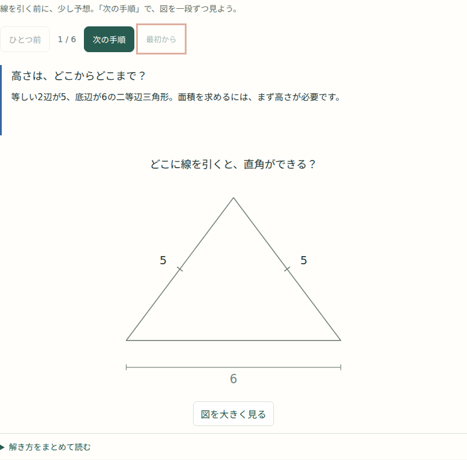
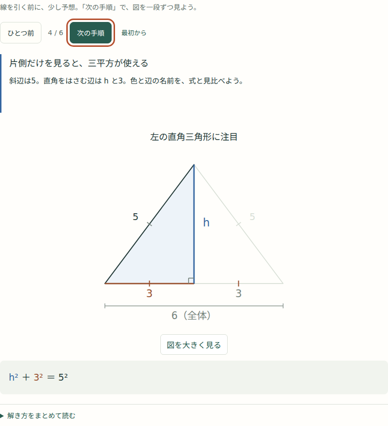

# 考える手順と一緒に変わる図：三平方の高さ

利用者の画面レビューを受け、Webの「高さを引くと、知っている形になる」（解説PDF 8ページ対応）を段階表示にしました。

以前の図は、高さ4・底辺の半分3・補助線が最初から揃っていました。今回は「どこに線を引くか」を予想し、変化を一つずつ追えるようにしています。

| 手順 | 図に現れるもの | 考えること |
| --- | --- | --- |
| 1 | 等しい2辺5・底辺6だけ | 高さはどこからどこまでか |
| 2 | 頂点から伸びる青い垂線 h と直角の印 | 直角三角形を作る |
| 3 | 左右の領域、等しい部分の印、3と3 | 斜辺5と共通の高さが等しい直角三角形は合同なので、底辺も半分 |
| 4 | 左の三角形を強調し、右を薄く残す | h²＋3²＝5²を、色の揃った図と式で見る |
| 5 | hが4へ変わる | 前の式を残し、h²＝16から正の長さ4を選ぶ |
| 6 | 全体の三角形と底辺6を強調 | 面積は全体の6×4÷2＝12。三平方に使った半分の3と区別する |

| 最初は予想する | 必要な三角形と式を見る |
| --- | --- |
|  |  |

「次の手順」「ひとつ前」「最初から」で自分のペースで進めます。自動再生はせず、形・位置・縮尺を固定しています。詳しい説明は「解き方をまとめて読む」から任意に開けます。

## 検証

- 新しいブラウザテストで、6段階、答えの先出し防止、戻る/リセット、図の5:5:6の比率、式、フォーカス、拡大、JavaScript無効・印刷・動きを減らす設定を確認。
- 1440/768/390pxの全6段階を画像化。SVG内の文字同士の重なり・領域外へのはみ出し、ページ全体の横はみ出しを検査。
- 既存の三平方の数学・操作・ブラウザテストが成功。新しいテストも `npm test` に登録。
- 拡大図が元のSVGのIDを複製していた点を修正し、拡大後も段階操作が正しい図を更新するようにした。
- 共通ビルドで再生成したPDF3冊は変更なし（Git差分なし）。紙は一覧で読み、Webは考える順番で追う役割を保つ。

今回はこの解説1か所への適用です。全体監査の残り33件や、他の解説図の段階表示は完了扱いにしていません。以降は、補助線・対応する辺・式の意味を段階的に見せる効果が大きい場所から広げます。

確認URL：[三平方・高さの説明](https://hirasunaryou.github.io/for_KT_family/study/math/pythagorean/index.html#lesson-7)。公開結果とCIは、この変更のPRおよび利用者への報告に記録します。
