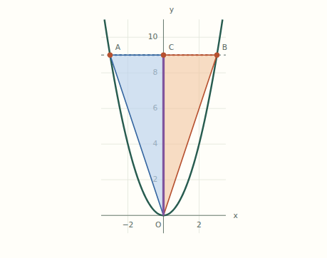
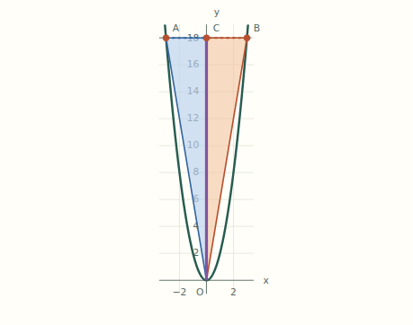
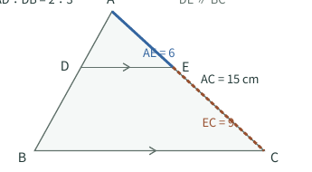
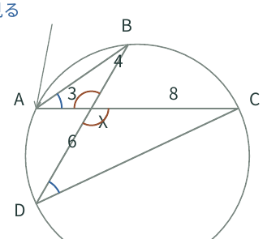
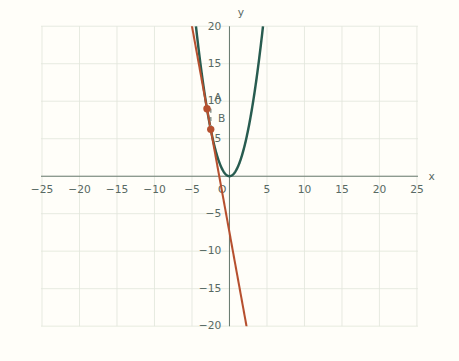
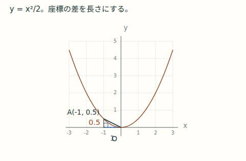

# 家族のまなび帳：全体点検と改善課題

点検日：2026年9月26日（日本時間）。対象：[公開サイト](https://hirasunaryou.github.io/for_KT_family/index.html)と、円・三平方を加えた確認用原稿。

**次に優先したいのは、説明の整合性、比較で誤解させない図、紙とWebの往復です。** 教材の核となる説明・問題・操作は育っていますが、教材が増えたことで入口の説明や学習の移動経路が追いついていません。また、正常に計算・表示できる状態でも、文字と線の衝突や操作後の視線・フォーカスの迷いが残っています。

このレポートは**初回点検で見つけた課題の記録**です。点検時に修正したのは、依頼された三平方の短辺への指示線と、直方体・取り出す三角形の対応です。

**修正状況（第1回）**：その後の修正依頼により、A01・A28・A31・A32の4件を修正・検証しました。状態は「修正済み・公開済み（第1回）」、残り33件は未修正です。[修正内容と検証記録](fixes-01.md) を参照してください。その後の利用者指示により、円・三平方と第1回修正を2026-09-26に公開しました。以下の点検結果は公開前の状態を記録しています。

## 1. 確認した範囲

| 対象 | 確認内容 |
| --- | --- |
| 全体の入口・ページ | 17 HTMLルート。ホーム、勉強、数学6単元、プログラミング、Python5教材と単体版、日々の疑問 |
| ページ間の移動 | Python29ミッション状態を追加した計46状態。表示DOMの1,037リンク・リソース参照を検査 |
| 数学のWeb | 6単元の説明・原稿・描画コード、重点的な境界操作。二次関数の近接点、相似の変形、円の3証明配置、三平方の角度・放物線の位置など |
| 印刷教材 | 18冊208ページ。うち三平方以外15冊161ページは全ページ画像一覧＋重点31ページを個別確認 |
| 今回の三平方 | 47ページを前版と画像比較。解説13・14、問題集12、解答12の4ページを個別確認。残り43ページは画像一致。Webの高さ2/12・全4段階を確認 |
| 使いやすさ | 9入口×3画面幅、Python32状態×3幅。Tab操作、戻る、保存拒否、JavaScript無効を再現 |
| 公開版との区別 | 公開ホームと「勉強」をHTTP取得。公開中の数学は4単元、円・三平方は未公開。未公開の教材が公開トップにないことは不具合に数えない |

点検開始時のローカルHEADは `bc92b41915c8916576e713c5c6764ac1da141622`、対応する確認用PR #3のremote HEADは `26dbe1cd886a976f23525ef7d573e54d37efe456`。両者は同じファイル内容です。ローカル `origin/main` は古いため公開版の根拠には使用していません。

リンク先ファイルの欠落、調査した画面の初期化例外、18冊のページ数表記の不一致は検出していません。Pythonの点検対象ではページ全体の横はみ出しもありませんでした。こうした正常動作と、以下の読み取り・操作上の課題は両立します。

## 2. 優先順と件数

重複を統合した改善対象は**37件**です。再現できる不整合・操作/表示不具合が15件、確認した現状に基づく設計改善が22件です。「提案」をすべてバグと扱ってはいません。

| 優先度 | 件数 | 意味 |
| --- | ---: | --- |
| P1 | 1 | 教える中心概念と矛盾する記述。最初に直したい |
| P2 | 26 | 理解・比較・探索・操作・保存に具体的な負担。次に改善したい |
| P3 | 10 | 一貫性や補助的な使いやすさを高める改善 |

実施順の案：

1. **説明と操作の信頼性**：A01の平方根の誤記、A32の保存状態の誤認、A28/A31のキーボード操作。
2. **図を見れば分かる状態**：A02の比較縮尺、A03/A04/A06/A07の重なり、A08の円の中心角。
3. **学習の道筋**：A22の古い入口、A20/A23/A24/A25の紙→Web→紙と単元間の接続。
4. **紙の説明の厚み**：A09〜A17。全部の文字を増やすのでなく、立式・対応・理由が抜ける図を補う。
5. **仕上げと保守**：P3群。旧教材の良さと問題番号を保ち、必要箇所から段階的に整える。

## 3. 初回点検の課題一覧（元の指摘を保持）

「既存」は公開中の単元の作業版で確認した意味です。公開ファイルとの一致を確認した範囲は末尾の記録を参照してください。「準備中」は円・三平方。「提案」は表示事実を確認したうえでの設計判断を含みます。

### 数学の説明・図・紙面

| ID | 優先度/種類 | 場所 | 確認した状態と改善の方向 | 詳細 |
| --- | --- | --- | --- | --- |
| A01 | P1・不整合 | 平方根Web「ルートの整理」 | 「36の平方根は6」が±6の説明と矛盾。計算は正しい。「√36=6」と区別する | math.md / M01 |
| A02 | P2・表示 | 二次関数・三角形面積 | a=1、Aのx=-3、Bのx=3からaを2倍。面積27→54でも自動縮尺で図の面積は0.72倍。比較前後を同じ範囲にする | math.md / M02 |
| A03 | P2・表示 | 二次関数・変域/変化の割合 | 近接したA/B、Aと目盛10が重なる。点の位置に応じたラベル回避が必要 | math.md / M03 |
| A04 | P2・表示 | 三平方・Web体験3（準備中） | x=-1で長さ1と原点O、±2で長さと目盛が接触。寸法・点名・目盛の帯を分ける | math.md / M04 |
| A05 | P2・不整合 | 三平方・Web体験1（準備中） | 1つの図を切り替えるのに「左の/右の」と説明。「最初/並べ替え後」に対応させる | math.md / M06 |
| A06 | P2・表示 | 相似・解答p7問14 | EC=9を辺が横切る。辺と直角方向にラベルを離す | pdfs.md / PDF-01 |
| A07 | P2・表示 | 円・解説p10/問20（準備中） | 交差弦の4・6が線上、Xと角印が近接。辺別のラベル位置と角印を調整 | pdfs.md / PDF-02 |
| A08 | P2・提案 | 円・証明（準備中） | 紙p5–6とWeb体験2で44°/70°、160°/40°の中心角が図にない。円周角との対応を段階的に示す | math.md / M05、pdfs.md / PDF-03 |
| A09 | P2・提案 | 二次方程式・解説p4 | 平方完成の面積はあるが辺x/3の寸法がない。x×3・3×3・x+3を対象の近くに示す | pdfs.md / PDF-04 |
| A10 | P2・提案 | 二次方程式・解説p5 | 一般形から平方完成済みの式へ飛ぶ。aで割る/定数を移す/同じ数を足すを追えるようにする | pdfs.md / PDF-05 |
| A11 | P2・提案 | 二次方程式・解答p9問31/32 | 道路幅2xと上下の二時刻が式・文だけ。解答に立式の根拠となる図を補う | pdfs.md / PDF-06 |
| A12 | P2・提案 | 二次関数・解答p5問26/p7問38 | 共通底辺OCと横向きの高さを図示せず文章で説明。2つの三角形に分ける図を添える | pdf-older.md / OLD-PDF-01 |
| A13 | P2・提案 | 二次関数・解説p3 | 割合8/2の8・2に対応する縦横の増加を図で探す必要がある。階段と数値を対応させる | pdf-older.md / OLD-PDF-02 |
| A14 | P2・提案 | 二次関数・紙のグラフ | 目盛りが実測7pt。等縮尺を保ち、必要な数値を読みやすくする | pdf-older.md / OLD-PDF-03 |
| A15 | P2・提案 | 平方根・解説p5/解答問26–27 | 素因数のペアと余り、面積から辺・周へのつながりを文章で補う。短い図を追加する | pdf-older.md / OLD-PDF-05 |
| A16 | P3・提案 | 相似・解説p5 | 相似条件を三角形1個ずつで示し、2図の対応が見えない。初回は比較する2つを並べる | pdfs.md / PDF-08 |
| A17 | P2・提案 | 相似・平行線Web体験 | 等しい2組の角を本文で説明するが角印がない。平行を崩した状態との違いを図へ | math.md / M07 |
| A18 | P3・提案 | 図の拡大操作 | 円の静的図は拡大可能だが動く証明図は対象外。必要な図で操作・呼称をそろえる | math.md / M08 |
| A19 | P3・提案 | 円/三平方・比較用破線 | 直前のinputが毎回基準になり、ゆっくり動かすとほぼ重なる。比較したい時点を保持する案 | math.md / M09 |

### 紙とWeb・単元間のつながり

| ID | 優先度/種類 | 場所 | 確認した状態と改善の方向 | 詳細 |
| --- | --- | --- | --- | --- |
| A20 | P2・提案 | 全18冊の紙→Web | URL/クリックリンクがなく、体験メモも番号中心。PCでも辿れるURLと体験への直接リンクを最小限置く | pdfs.md / PDF-07、pdf-older.md / OLD-PDF-04 |
| A21 | P3・不整合 | 相似p17、円p12の問題案内 | 内容に直接対応する問題と後日の再挑戦が混ざる。ページ単位で分ける | pdfs.md / PDF-09 |
| A22 | P2・不整合 | 公開「勉強」入口 | 数学「2つの教材/平方根と二次関数」が残る。教科と単元も同列。件数・説明・階層を一覧に合わせる | navigation.md / N01 |
| A23 | P2・提案 | 数学一覧・単元末尾 | 追加順が三平方→円→相似…となり学習順の説明がない。学び始めと次の単元の道筋を用意 | navigation.md / N05 |
| A24 | P2・提案 | 既習単元への復習リンク | 多くは長い教材の先頭に戻る。必要な説明への直接リンクと元の問題への戻りを設計 | navigation.md / N06 |
| A25 | P2・提案 | 円/三平方のWeb→紙 | 円は体験後の別問題への出口が弱い。三平方は別条件の問いはあるが対応問題/解答リンクがない | navigation.md / N08、math.md / M10 |
| A26 | P3・提案 | 公開ホーム | 主ボタンが二次関数に固定。特集の理由を示すか、教材を選ぶ入口を主にする | navigation.md / N07 |
| A27 | P3・提案 | 平方根のヘッダー | Family Learning/家族の学習室という旧名が残る。現在のサイト名・戻る導線をそろえる | navigation.md / N09 |

### 操作・保存・制作基盤

| ID | 優先度/種類 | 場所 | 確認した状態と改善の方向 | 詳細 |
| --- | --- | --- | --- | --- |
| A28 | P2・操作 | 金庫/迷路/ドット絵 | 「本文へスキップ」で現在の章から遊ぶ画面に戻る。アンカーと画面切替を分ける | navigation.md / N02 |
| A29 | P2・操作 | Jupyterサイコロ | 次章へ進んだ後「戻る」で前章ではなく教材一覧へ。章移動の履歴を残す | navigation.md / N03、usability.md / U04 |
| A30 | P2・操作（条件付き） | Python全5教材 | JS無効時に説明と配布ファイルまで消える。最低限の概要・素材・避難先を静的に残す | navigation.md / N04、usability.md / U05 |
| A31 | P2・操作 | ブラウザPython入力欄 | Tab/Shift+Tabで字下げし続け、キーボードで外へ移れない。字下げと脱出操作を両立 | usability.md / U01 |
| A32 | P2・保存 | ブラウザPython | 保存不可の警告が消えた後も自動保存と表示。再読込で自作コードを失う。保存状態を常設し手動保存へ案内 | usability.md / U02 |
| A33 | P2・操作 | 金庫ゲーム/章切替 | DOM更新でフォーカスがBODYへ。連続操作と新章への移動先を保つ | usability.md / U03 |
| A34 | P3・提案 | ドット絵グリッド | Tabの停止点が256個。グリッド内は矢印キー、Tabは次の操作へという方式を検討 | usability.md / U06 |
| A35 | P3・提案 | 旧2単元の解答 | 「ヒントだけ見る」と案内するが、正答→解説→ヒントの配置。ヒントを読むと答えが目に入る | pdf-older.md / OLD-PDF-06 |
| A36 | P3・提案 | 二次関数・解説p2 | 3本の放物線と式・凡例が離れている。白黒の線種を保ち、曲線の近くに対応を示す | pdf-older.md / OLD-PDF-07 |
| A37 | P3・提案（保守） | 旧2単元のPDF | 6冊の再生成元/手順がrepoにない。問題番号・見た目を保って再生成可能な原稿を管理する | pdf-older.md / OLD-PDF-08 |

## 4. 代表例を画像で確認する

### A02：面積は2倍なのに、画面では小さくなる

a=1、Aのx=-3、Bのx=3から「aだけ2倍」。数学上の面積は27→54です。縦横同倍率という正しさは守られていますが、前後で倍率が変わり、比較の目的を弱めています。

| 操作前 | 操作後 |
| --- | --- |
|  |  |

### A06/A07：対応を見せたい数値を線が横切る

| 相似の解答問14 | 円の交差弦 |
| --- | --- |
|  |  |

### A03/A04：動かすと生じるラベル衝突

| 二次関数の近接点 | 三平方の長さ1と原点O |
| --- | --- |
|  |  |

ほかの代表証跡：[円の証明で中心角を探す場面](evidence/circle-proof.png)、[保存拒否後も自動保存の案内が残る画面](evidence/storage-denied.png)、[Tabで抜けられないコード欄](evidence/keyboard-editor.png)。操作上の問題は画像だけでは判定できないため、各詳細レポートに再現手順を記載しています。

## 5. 今回修正した三平方（未修正一覧には含めない）

- 解説13ページ：短い辺の左側に短い注釈を置き、辺にほぼ垂直な方向から指す。辺と注釈を同色にし、xの文字を避ける。
- 解説14ページ・問23/24・Web体験4：底面ABC＝茶、断面ACG＝淡青、共通AC＝青。塗りの後に箱の辺を描き、手前BFを明確に残す。
- 取り出した図にもA/B/C/Gを添え、青いACが「①の斜辺→②の底辺」となる関係を示す。数値と頂点名の位置を分ける。
- Webの「取り出す」矢印は高さ固定をやめ、取り出した三角形の位置に合わせる。高さ2と12で全4段階を確認。
- 問題集には解答の数値・完成した補助図を先取りして載せない。

改訂版：[解説v4](../../../materials/pythagorean/previews/pythagorean-guide-v4.pdf)、[問題集v3](../../../materials/pythagorean/previews/pythagorean-workbook-v3.pdf)、[解答v3](../../../materials/pythagorean/previews/pythagorean-answers-v3.pdf)。正式PDF・Webも共通原稿から再生成済み。三平方の数学・操作・ブラウザテスト成功。

## 6. 維持したい点と、今回の限界

維持したいのは、平方根の短い説明と段階練習、二次関数の縦横等縮尺、二次方程式の前の式を残す操作、相似の「部分と全体」を近くの図で示す方法です。円・三平方の既習事項を使う流れ、Pythonの仕様→道具→ヒント→完成例、問題集の記入余白も、改善のために壊す必要はありません。

全体を同じレイアウトに揃えることや、問題数を増やすことは今回の結論ではありません。**どこを見るか、何を比べるか、次に何を自分で解くかが分かる**ように、課題のある場所を直すのが適切です。

今回の確認は網羅的な入口点検と重点操作・画像レビューです。全問題を独立に解き直した監査、実機Safari/Firefox、スクリーンリーダー、全ページの全ラベルを最大倍率で見た保証、Jupyter実機で全セルを最初から手入力した確認ではありません。PDFの文字サイズは画像印象だけで断定せず、円の小さい文字は実測で下限補正を確認し、サイズ違反としての指摘を除外しています。

詳細：[導線](navigation.md)／[数学Web](math.md)／[紙の新3単元](pdfs.md)／[紙の旧2単元](pdf-older.md)／[Pythonと使いやすさ](usability.md)。代表画像は同梱、全ページ画像は再生成可能な点検用中間物です。初回監査では既存教材を変更せず、その後の修正は第1回の記録に分けています。

### 公開ファイルの追加照合

公開の平方根HTML、二次関数app.js、Pythonのdice/jupyter/vault/maze/pixelの各app.jsの計7ファイルは、すべてHTTP 200かつ調査した作業版とSHA-256が一致しました。主要な説明・操作課題は公開版にも同じ実装があると確認できています。照合日時・URL・hashは [公開照合記録](public-verification.json) を参照してください。円・三平方は引き続き準備中として区別します。

課題を表計算で整理する場合は [課題一覧CSV](issues.csv) を利用できます。4件は修正済み・公開済み（第1回）、残り33件は未修正です。
