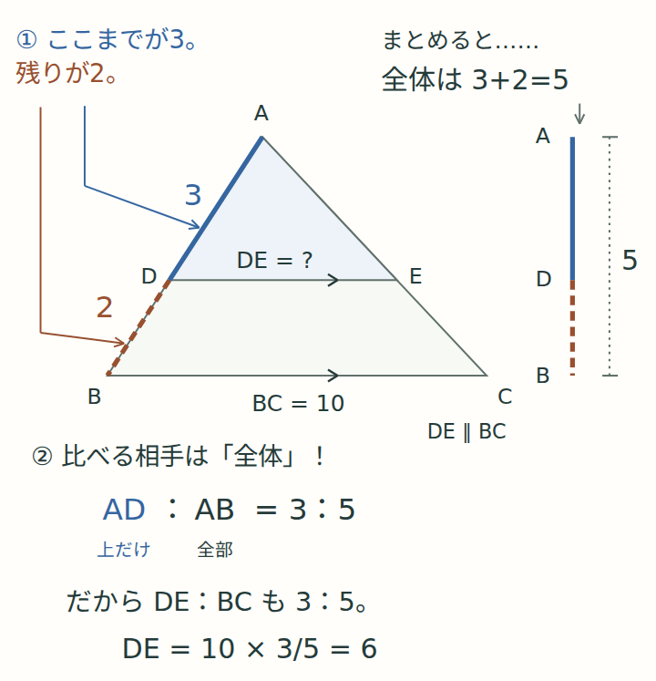

# 相似：紙で考え、4つの体験で確かめる

対象は中学3年生。既存の平方根・二次関数・二次方程式に続く図形教材です。
公開ページは `study/math/similarity/index.html`。閲覧時の外部依存・通信はありません。

## 学び方

- 1回目：問1〜12、Web体験①②（対応・倍率・相似条件）。
- 2回目：問13〜20、体験③（平行線・部分と全体・証明）。
- 3回目：問21〜28、体験④（面積比・体積比・活用）。
- 問29〜32は翌日以降の再挑戦。
- A4の解説18ページ・問題集18ページ・解答解説14ページ。問題集の最後の2ページは体験メモ。
- 紙で予想 → 操作 → 気づきを一言 → 別の問題を紙で解く。解答は別冊。
- 3冊のページ数は余白と記述欄を優先したものです。一度に全部を解く必要はありません。

## 原稿と生成

- `content.json`：8章の解説、32問、ヒント・解答・理由。紙とWebの共通原稿。
- `labs.html`：4つの実験の操作・予想・振り返り。
- `scripts/build-similarity.py`：HTMLとPDFを生成。静的な図は共通のベクトル図データから描画。
- `assets/similarity/model.js`：縮尺・面積・相似変換・平行線の純粋計算。
- `assets/similarity/app.js`：4体験、問題グループ、自己評価。
- `assets/similarity/style.css`：共通デザインに重ねる単元固有スタイル。

原稿を変更したら、静的な日本語TrueTypeフォントを指定して再生成します。
フォントは生成者が用意してください。閲覧者にフォントのインストールは不要です。
PDFには使用文字のフォントが埋め込まれます。

```sh
python3 -m pip install reportlab fonttools
python3 scripts/build-similarity.py --font /path/to/NotoSansJP-Regular.ttf
npm run test:similarity
```

生成済みHTMLと3冊のPDFをコミットします。Python依存は制作時のみ。
表示のためのWebビルドやCDNは使いません。MathMLを必要としない短い式と日本語で説明します。

## 可視化の約束

1. 平面図の縦横は同じ縮尺。実験の各表示枠内では縮尺を固定。
2. 対応実験は前の輪郭を破線で残す。移動・回転・反射で長さを変えず、最後にだけ倍率を変更。
3. 平行実験は丸める前の点の位置で判定する。表示する小数には近似を明示。
4. 立体図は平行投影の模型。画面上の角・斜めの長さを測る図ではないと注記。
5. 面積・体積の結果は最初は隠し、条件を変えるたび再び隠す。
6. 実験からの発見と、相似条件を使った説明を区別。単なる見た目を証明にしない。

学習記録キーは `family-similarity-v1`。他の単元の記録を保持します。
不正な保存値は無視し、保存できない環境でも画面内で自己評価を続けられます。
JavaScript無効時も解説・全32問・解答の開閉とPDFリンクが利用できます。

## 検証

- `tests/similarity.cjs`：独立した数値計算、縮小・拡大、非一様変形、169通りの点配置、対応変換の辺比、原稿と32問の一致、保存・問題リンク・相対URL。
- `tests/similarity-smoke.cjs`：Chromiumで4体験、SVG範囲、同縮尺、結果の再非表示、解答開閉、保存と再読込、390/768/1440px、保存拒否、オフライン、JS無効、PDF応答。
- 既定はPlaywrightのChromium。制作環境で別の検証用Chromiumを使う場合だけ `PLAYWRIGHT_CHROMIUM_EXECUTABLE_PATH` を指定可能。
- PDFは全ページを画像化し、レイアウトを目視確認。生成時にもページ・問題枠の高さとフォントの字形を検査。

今後の単元は円、三平方の定理の順。未実装ページへのリンクは置いていません。

## 読みやすさの設計

- 解説は18ページ。各ページを「見るポイント1つ・図・短い3段階・持ち帰る一言」に統一。
- `visual-lessons.json` が紙とWeb共通の視覚的な解説原稿。詳しい文章は `content.json` に保持し、Webでは任意に開く補足に配置。
- `scripts/similarity_visuals.py` に共通の図を定義。色に加え、実線・破線・点線と、角の弧の本数で対応を示す。
- 本文の対応記号にも図と同じ色・線種を付ける。黒白印刷時もラベルと線種で追える。
- 問題集の書き込み欄・32問の内容は維持。Webの問題文と解答の各段階は間隔を広げる。
- 制作側の確認とは別に、実際の学習者が図を探さず追えるかを利用時に確かめる。

## ホワイトボードのように読む試作

解説7〜9ページとWebの対応箇所では、説明文を図の周りへ移し、矢印を実際の角・辺へ向けています。
`similarity_boards.py` に配置を定義し、紙とWeb・単独SVGへ同じ描画を使用します。
これは全体へ展開する前の3ページの試作です。詳しい文章はWebで開いて確認できます。
矢印は説明の指示線、辺の上の同じ向きの印は平行の印です。
小さい画面では「図を大きく開く」から単独SVGを拡大できます。



### 見た目の微調整（v4）

ホワイトボード3ページの大きな文字を約6%抑え、PDF内の図版幅を507ptから480ptに変更。
小さなラベルは元の文字サイズを保ち、指示線と強調線を少し細くしました。
感嘆符を抑え、説明と図の近さを維持しながら周囲の余白を増やしています。

### 学びのつながりを図にする（v5）

最後の18ページにも図の周囲で説明する形式を適用。
面積1と2の正方形（辺は1と√2）、縦のみ／縦横の三角形の拡大、
3・4・5と6・8・10の直角三角形を描き、平方根・二次関数・三平方・三角比へのつながりを示します。
長さや面積は描画上でも正しい比率です。文字だけの説明はWebで開いて確認できます。
現在この形式を適用しているのは7〜9ページと18ページです。


## 問題集の紙面改訂（v2）

- 全32問を1ページ2問に統一。問題16ページ＋Web体験メモ2ページ。
- 問題文・番号・解答は維持し、句点と小問番号で読みやすく改行。
- `scripts/similarity_workbook.py` で問題専用のベクトル図と解答欄を生成。図の文字は9 pt以上、本文10.5 pt。
- 与えられた長さ・角・面積を図の近くに配置。平行記号、中点の等長記号、角の弧を併記し、色だけに依存しない。
- 図の右に途中式・理由の欄。図のない問いには作図にも使える空白を用意。対応や証明の根拠は解答として書き込む。
- 座標図は等縮尺。拡大倍率・面積比を示す図は縦横同倍率で描画。
- 全18ページを画像化して目視確認し、PDF内の全32問と原稿の一致を確認。既存の相似DOM・ブラウザ検証も成功。
- 確認用固定名：`previews/similarity-workbook-visual-v2.pdf`。
